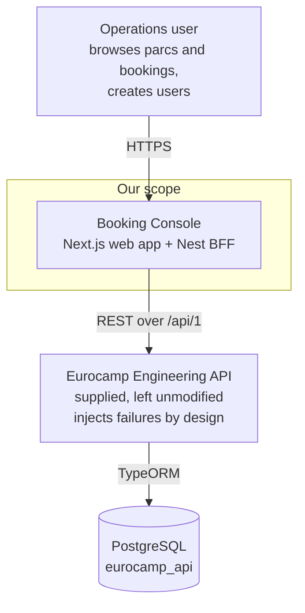
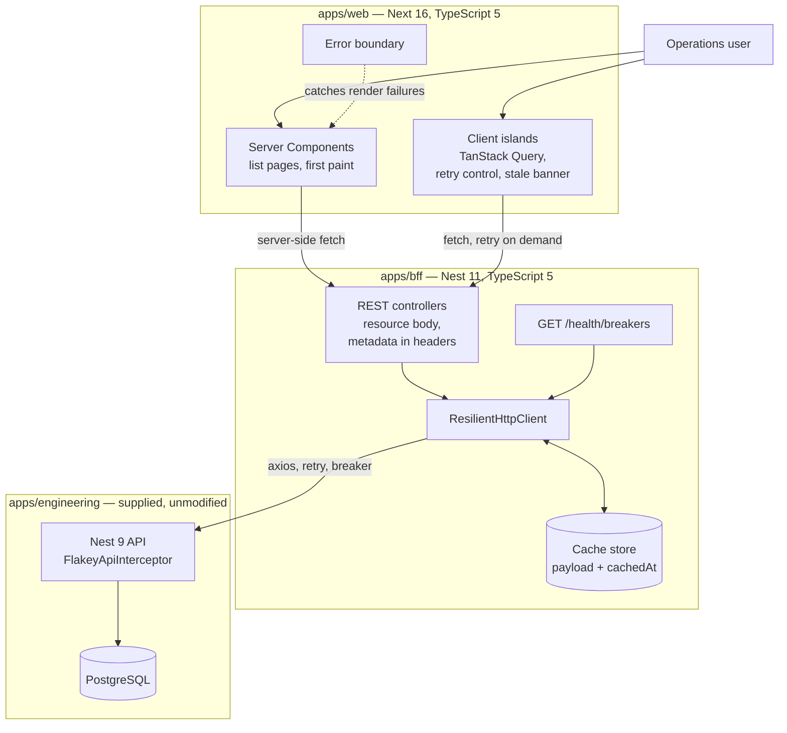
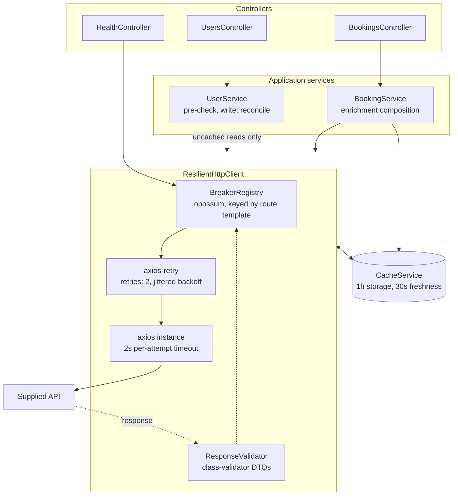
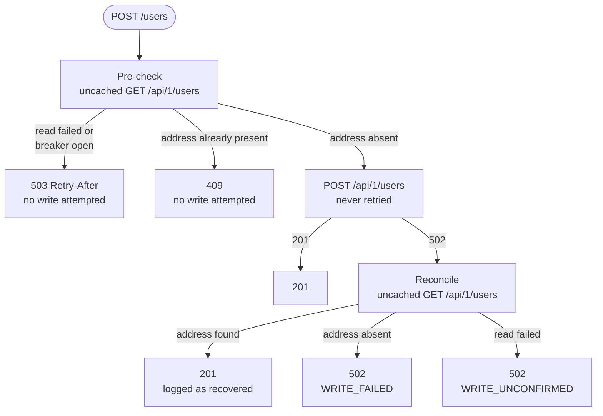

# Architecture

C4 model, levels 1 to 3, plus the two decision paths that carry the design.
All diagrams use mermaid `flowchart` syntax.

## Level 1 — System context



The supplied API is treated as a third-party system we do not control and may
not change. Every resilience concern therefore lives on our side of that
boundary.

## Level 2 — Containers



Three independent installs. The version table in `NOTES.md` explains why the
web and BFF containers each carry their own manifest rather than joining the
supplied Nx workspace.

## Level 3 — Components inside the BFF



The nesting order is load-bearing. Because `axios-retry` operates inside the
axios instance, the breaker's action function settles once per exhausted retry
cycle rather than once per attempt. A breaker counting individual attempts
would trip after two requests against a 10%-flaky endpoint and stay open.

`UserService` bypasses the cache entirely, because its reads establish ground
truth about a write rather than display data.

## Read path

```mermaid
flowchart TB
    start(["GET request from web"]) --> kind{"Enrichment lookup<br/>cached within 30s?"}

    kind -->|"yes"| hit["200, X-Cache: hit<br/>upstream not called"]
    kind -->|"no, or a primary read"| bopen{"Breaker open<br/>for this route?"}

    bopen -->|"yes"| fb1{"Cached payload<br/>exists?"}
    fb1 -->|"yes"| stale["200<br/>X-Cache: stale, Age"]
    fb1 -->|"no"| s503["503<br/>Retry-After"]

    bopen -->|"no"| call["axios call<br/>3 attempts, jittered backoff"]

    call -->|"404 or other 4xx"| pass["Passthrough<br/>no cache fallback<br/>breaker untouched"]
    call -->|"2xx"| valid{"Passes DTO<br/>validation?"}
    call -->|"5xx or network,<br/>all attempts failed"| fb2{"Cached payload<br/>exists?"}

    fb2 -->|"yes"| stale
    fb2 -->|"no"| s502["502"]

    valid -->|"every row valid"| store["Store payload with cachedAt<br/>200, X-Cache: miss"]
    valid -->|"some rows dropped"| partial["Store filtered rows<br/>200, X-Dropped-Records"]
    valid -->|"nothing usable"| nostore["Cache left untouched<br/>502"]
```

Primary reads always attempt upstream; the cache answers only on failure. Only
enrichment lookups carry a freshness window, and only validated payloads are
written, so a bad response cannot poison the fallback. A 4xx never falls back
to cache — the resource is gone, and serving a cached copy would resurrect it.

## Write path



The three terminal states on the right are the rule from ADR 0001. `503` before
any write is safely retryable because state is unchanged; `WRITE_UNCONFIRMED`
after the attempt is not, because the outcome is unknowable.
